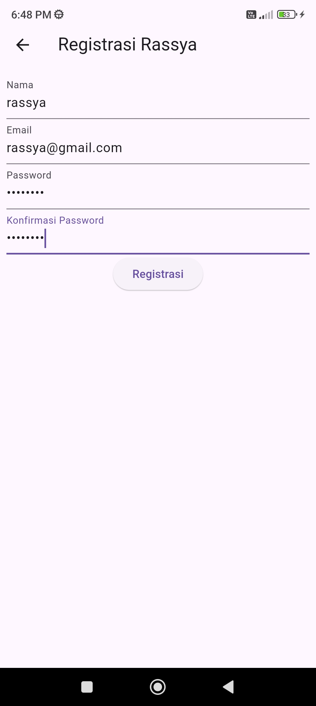
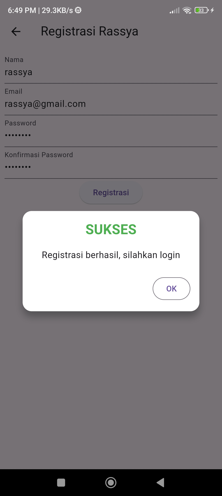
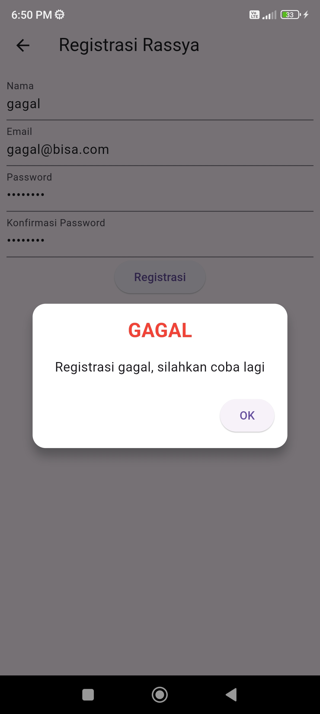
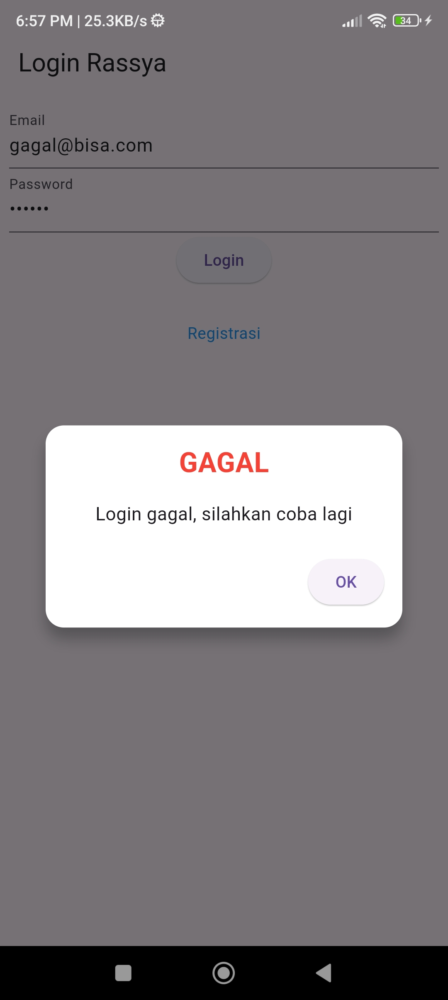
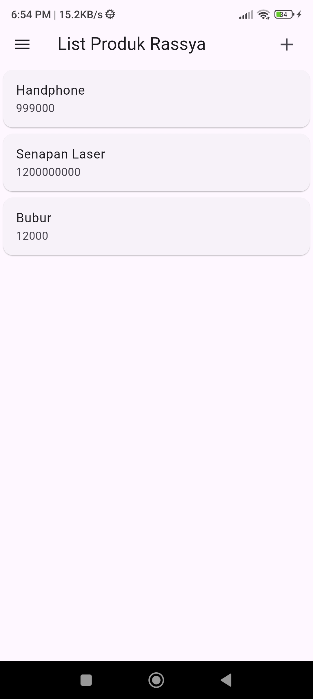
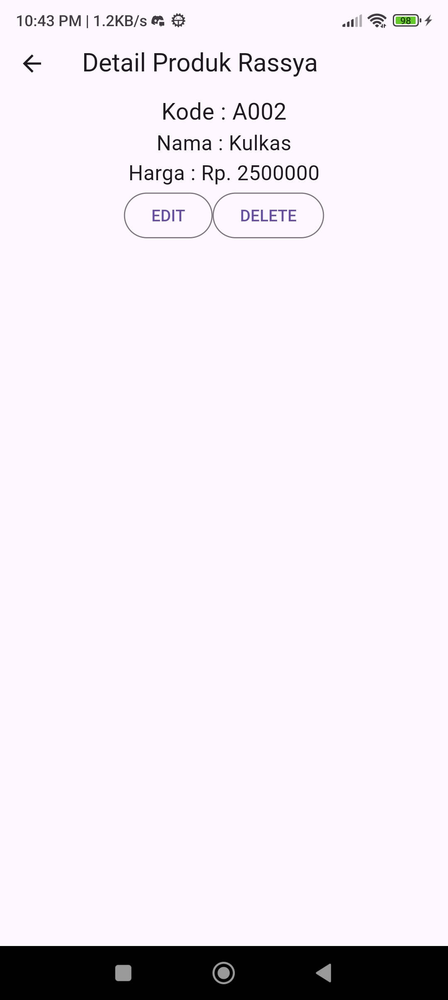
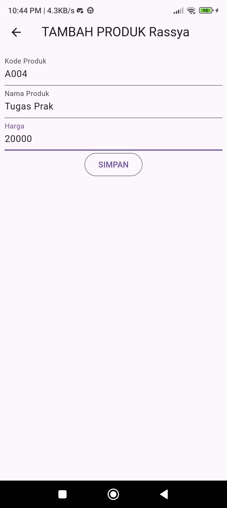
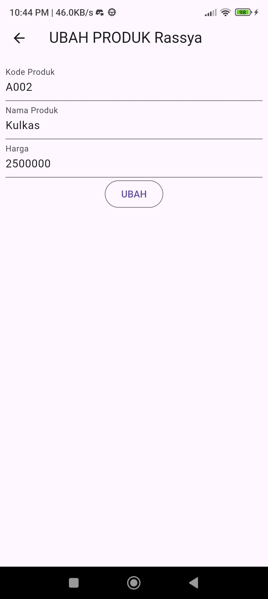

# tokokita

Nama    : Rassya Hafizh Suharjo

NIM     : H1D022068

Shift Baru : A

Shift Lama : D

## screenshot dan penjelasan serta kode

### Registrasi
1. Tampilan page registrasi = registrasi_page.dart
Page registrasi terdiri atas 3 texteditingcontroller yang kemudian dibuat menjadi 4 textfield untuk memasukkan nilai dan 1 elevatedbutton untuk tombol submit.
``` dart
final _formKey = GlobalKey<FormState>();
  bool _isLoading = false;
  final _namaTextboxController = TextEditingController();
  final _emailTextboxController = TextEditingController();
  final _passwordTextboxController = TextEditingController();

body: SingleChildScrollView(
        child: Padding(
          padding: const EdgeInsets.all(8.0),
          child: Form(
            key: _formKey,
            child: Column(
              mainAxisAlignment: MainAxisAlignment.center,
              children: [
                _namaTextField(),
                _emailTextField(),
                _passwordTextField(),
                _passwordKonfirmasiTextField(),
                _buttonRegistrasi()
```


2. Registrasi berhasil dan gagal = registrasi_page.dart -> registrasi_bloc.dart
Jika memasukkan value ke TextField dan menekan registrasi, maka widget buttonRegistrasi akan memanggil method submit yang mengirimkan value nama, email, dan password ke registrasi_bloc.dart. jika registrasi berhasil maka akan memanggil showdialog SuccesDialog, sedangkan bila error/gagal akan memanggil WarningDialog
``` dart
Widget _buttonRegistrasi() {
    return ElevatedButton(
        child: const Text("Registrasi"),
        onPressed: () {
          var validate = _formKey.currentState!.validate();
          if (validate) {
            if (!_isLoading) _submit();
          }
        });
  }

  void _submit() {
    _formKey.currentState!.save();
    setState(() {
      _isLoading = true;
    });
    RegistrasiBloc.registrasi(
            nama: _namaTextboxController.text,
            email: _emailTextboxController.text,
            password: _passwordTextboxController.text)
        .then((value) {
      showDialog(
          context: context,
          barrierDismissible: false,
          builder: (BuildContext context) => SuccessDialog(
                description: "Registrasi berhasil, silahkan login",
                okClick: () {
                  Navigator.pop(context);
                },
              ));
    }, onError: (error) {
      showDialog(
          context: context,
          barrierDismissible: false,
          builder: (BuildContext context) => const WarningDialog(
                description: "Registrasi gagal, silahkan coba lagi",
              ));
    });
    setState(() {
      _isLoading = false;
    });
  }
```

kemudian pada registrasi_bloc.dart data dikirimkan ke restful api menggunakan var apiUrl pada api_url.dart sehingga bisa masuk ke database.
``` dart
class RegistrasiBloc {
  static Future<Registrasi> registrasi(
      {String? nama, String? email, String? password}) async {
    String apiUrl = ApiUrl.registrasi;
    var body = {"nama": nama, "email": email, "password": password};
    var response = await Api().post(apiUrl, body);
    var jsonObj = json.decode(response.body);
    return Registrasi.fromJson(jsonObj);
  }
}
```

``` dart
class ApiUrl {
  static const String baseUrl = 'http://10.99.4.182:8080'; //diganti lagi ke yg pdf ga pake punya sendiri wkwkwk
  static const String registrasi = baseUrl + '/registrasi';
```




### Login
1. Halaman login = login_page.dart
pada halaman login terdapat 2 TextField dan 1 Button untuk login serta sebuah widget yang mengarahkan ke halaman registrasi.
```dart
class _LoginPageState extends State<LoginPage> {
  final _formKey = GlobalKey<FormState>();
  bool _isLoading = false;
  final _emailTextboxController = TextEditingController();
  final _passwordTextboxController = TextEditingController();

  @override
  Widget build(BuildContext context) {
    return Scaffold(
      appBar: AppBar(
        title: const Text('Login Rassya'),
      ),
      body: SingleChildScrollView(
        child: Padding(
          padding: const EdgeInsets.all(8.0),
          child: Form(
            key: _formKey,
            child: Column(
              children: [
                _emailTextField(),
                _passwordTextField(),
                _buttonLogin(),
                const SizedBox(
                  height: 30,
                ),
                _menuRegistrasi()
```
2. Login berhasil dan Gagal = login_page->login_bloc.dart
Jika menekan button untuk login maka akan memanggil method submit yang didalamnya mengambil nilai inputan dari TextField yang ada dan mengirimkan ke logi_bloc.dart. Jika berhasil terkirim dan sesuai database maka akan langsung diarahkan ke page List Produk, sedangkan bila gagal atau error maka akan menampilkan popup ShowDialog berupa WarningDialog.
```dart
Widget _buttonLogin() {
    return ElevatedButton(
        child: const Text("Login"),
        onPressed: () {
          var validate = _formKey.currentState!.validate();
          if (validate) {
            if (!_isLoading) _submit();
          }
        });
  }

  void _submit() {
    _formKey.currentState!.save();
    setState(() {
      _isLoading = true;
    });
    LoginBloc.login(
            email: _emailTextboxController.text,
            password: _passwordTextboxController.text)
        .then((value) async {
      if (value.code == 200) {
        await UserInfo().setToken(value.token.toString());
        await UserInfo().setUserID(int.parse(value.userID.toString()));
        Navigator.pushReplacement(context,
            MaterialPageRoute(builder: (context) => const ProdukPage()));
      } else {
        showDialog(
            context: context,
            barrierDismissible: false,
            builder: (BuildContext context) => const WarningDialog(
                  description: "Login gagal, silahkan coba lagi",
                ));
      }
    }, onError: (error) {
      print(error);
      showDialog(
          context: context,
          barrierDismissible: false,
          builder: (BuildContext context) => const WarningDialog(
                description: "Login gagal, silahkan coba lagi",
              ));
    });
    setState(() {
      _isLoading = false;
    });
  }
```

di login_bloc.dart data dikirim ke api dan dicocokkan dengan database.
```dart
class LoginBloc {
  static Future<Login> login({String? email, String? password}) async {
    String apiUrl = ApiUrl.login;
    var body = {"email": email, "password": password};
    var response = await Api().post(apiUrl, body);
    var jsonObj = json.decode(response.body);
    return Login.fromJson(jsonObj);
  }
}
```


### Produk
1. List Produk = produk_page.dart
Pada 'produk_page.dart' terdapat sebuah getter bernama 'GetProduks' yang mengambil nilai yang diambil oleh 'produk_bloc.dart' dari database mebggunakan api.
produk_page
```dart
body: FutureBuilder<List>(
        future: ProdukBloc.getProduks(),
        builder: (context, snapshot) {
          if (snapshot.hasError) print(snapshot.error);
          return snapshot.hasData
              ? ListProduk(
                  list: snapshot.data,
                )
              : const Center(
                  child: CircularProgressIndicator(),
                );
        },
      ),
```

produk_bloc
```dart
static Future<List<Produk>> getProduks() async {
    String apiUrl = ApiUrl.listProduk;
    var response = await Api().get(apiUrl);
    var jsonObj = json.decode(response.body);
    List<dynamic> listProduk = (jsonObj as Map<String, dynamic>)['data'];
    List<Produk> produks = [];
    for (int i = 0; i < listProduk.length; i++) {
      produks.add(Produk.fromJson(listProduk[i]));
    }
    return produks;
  }
```
Hasil value database yang diambil kemudian dicek oleh itemcount. Apabila != 0 dan >1, maka akan menampilkan widget card yang berisi list produk dan harganya.
```dart
Widget build(BuildContext context) {
    return ListView.builder(
        itemCount: list == null ? 0 : list!.length,
        itemBuilder: (context, i) {
          return ItemProduk(
            produk: list![i],
          );
        });
  }
```

```dart
Widget build(BuildContext context) {
    return GestureDetector(
      onTap: () {
        Navigator.push(
            context,
            MaterialPageRoute(
                builder: (context) => ProdukDetail(
                      produk: produk,
                    )));
      },
      child: Card(
        child: ListTile(
          title: Text(produk.namaProduk!),
          subtitle: Text(produk.hargaProduk.toString()),
        ),
      ),
    );
  }
```


### produk_detail.dart


### produk_form.dart
#### Tambah Produk => produk_page

#### Ubah Produk => produk_detail
